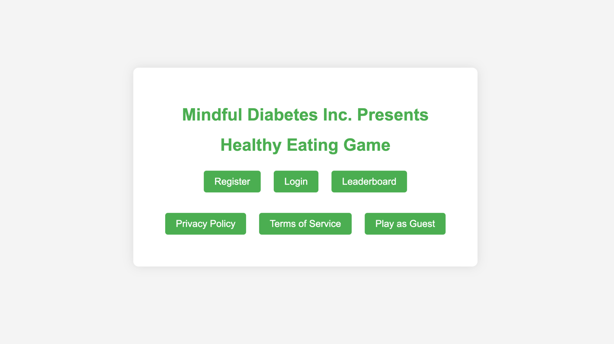
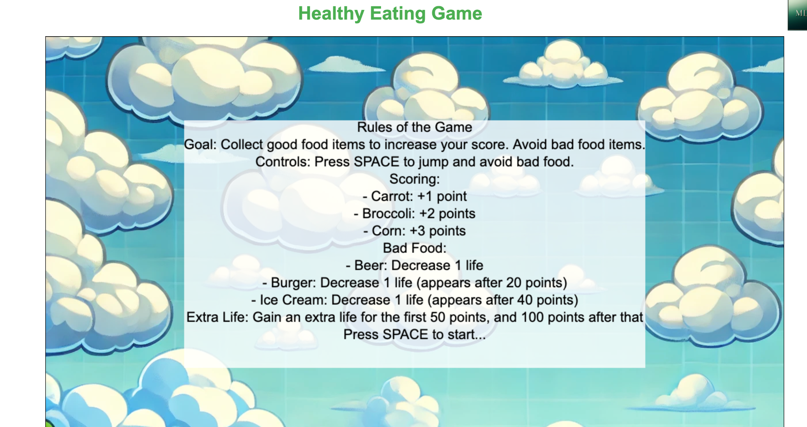
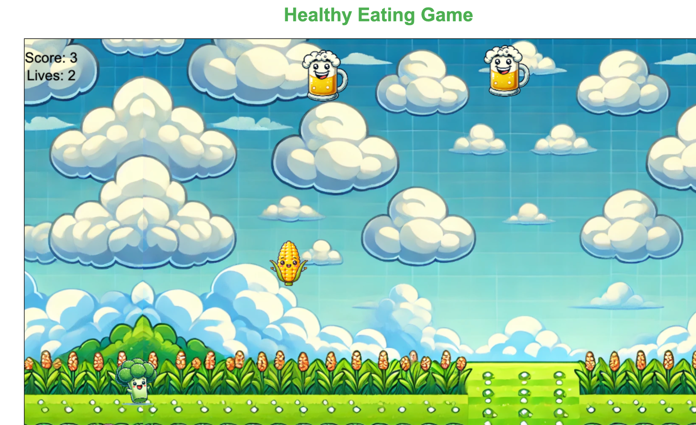
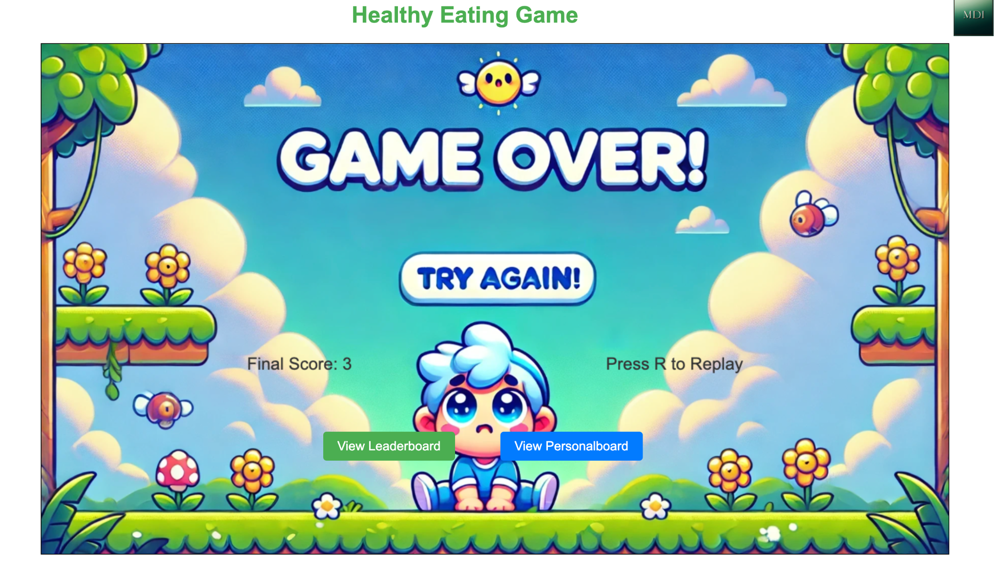

# Jeir.Fun — Mindful Diabetes Healthy Eating Game

> A fast, family-friendly 2D side-scroller where you collect healthy foods, dodge unhealthy ones, and climb the leaderboard — created by **Mindful Diabetes Inc.** to make nutrition fun.

[▶ Play Now](https://www.jeir.fun/main_game) · [Leaderboard](#leaderboards) · [Privacy](#privacy--accounts) · [Contact](#contact)

---

  

## Table of Contents
- [Overview](#overview)
- [How to Play](#how-to-play)
- [Scoring](#scoring)
- [Progression & Difficulty](#progression--difficulty)
- [Leaderboards](#leaderboards)
- [Privacy & Accounts](#privacy--accounts)
- [Screenshots](#screenshots)
- [Tech Notes](#tech-notes)
- [Credits](#credits)
- [License](#license)
- [Contact](#contact)

---

## Overview
**Healthy Eating Game** is an endless side-scrolling mini-game where players:
- 🥕 **Collect healthy foods** to score points
- 🚫 **Avoid unhealthy foods** that cost lives
- 🏆 **Compete on a leaderboard** or play casually as a guest

It’s designed for kids, families, and classrooms — quick to learn, delightful to master, and built to reinforce healthy choices in a playful way.

> **Educational Use Only:** This game promotes general healthy habits and is **not** medical advice.

## How to Play
- **Goal:** Survive as long as you can while maximizing your score.
- **Controls:** Press **Space** to jump.
- **Game Over:** When you lose all lives, submit your name to record your high score and try again.

  

## Scoring
**Good Food (+ points)**
- Carrot: **+1**
- Broccoli: **+2**
- Corn: **+3**

**Bad Food (− lives)**
- Beer: **−1 life**
- Burger: **−1 life** (appears after **20** points)
- Ice Cream: **−1 life** (appears after **40** points)

## Progression & Difficulty
- **Extra Life:** Gain **+1 life** at **50** points (first time), then **every 100 points** after that.
- **Ramp-up:** New hazards appear as your score grows, increasing challenge over time.

  

## Leaderboards
- **Global Leaderboard:** See top scores across all players.
- **Personalboard:** Track your own best runs over time.
- **Guest Mode:** Don’t want an account? Play immediately as a guest (scores aren’t saved to your profile).

  

## Privacy & Accounts
- You can **Register/Login** to save scores or **Play as Guest** without an account.
- We keep things simple — **no sensitive personal information is required** to enjoy the game.
- Links to our **Privacy Policy** and **Terms of Service** are available from the main menu.

## Screenshots
- Main Menu — `assets/screenshot-menu.png`
- Rules Overlay — `assets/screenshot-rules.png`
- Gameplay — `assets/screenshot-gameplay.png`
- Game Over — `assets/screenshot-gameover.png`

## Tech Notes
- Designed for **quick play** on desktop/laptop browsers.
- Local prototype built with **Python + Pygame**; the public version is hosted at the link above.
- Source code for the production game is private; this repository is a **public showcase**.

## Credits
- **Game Design & Development:** Joseph-Michael Schulz (Mindful Diabetes Inc.)
- **Artwork:** AI-assisted illustrations (curated and post-processed)
- **Community:** Families and educators supporting the MDI mission

## License
Documentation in this repository is released under the **MIT License**.  
The production application source code remains private.

## Contact
Questions, classroom use, or partnership ideas?  
**Mindful Diabetes Inc.** · hello@mindfuldiabetes.org

---

**Play now:** https://www.jeir.fun/main_game
